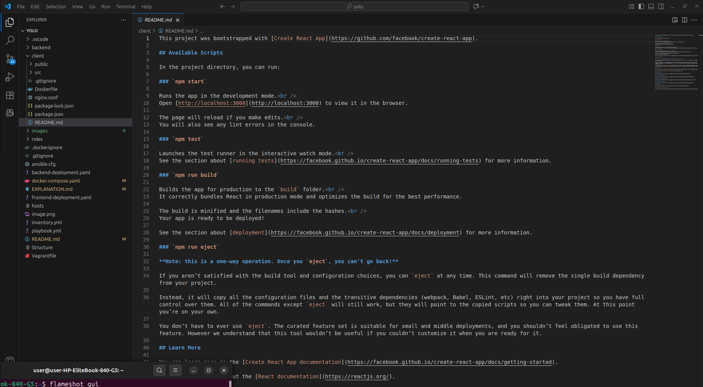
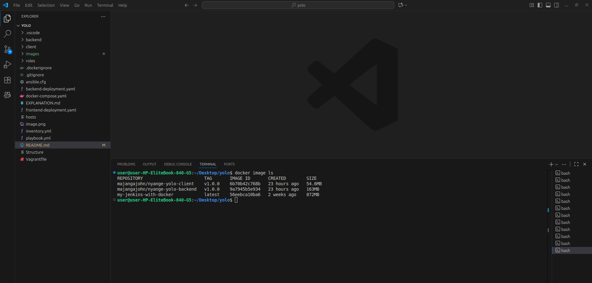
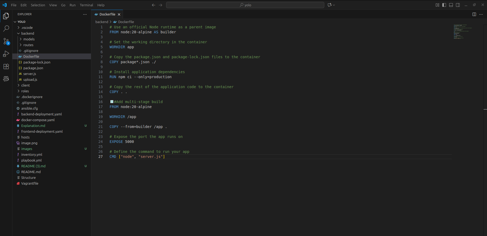
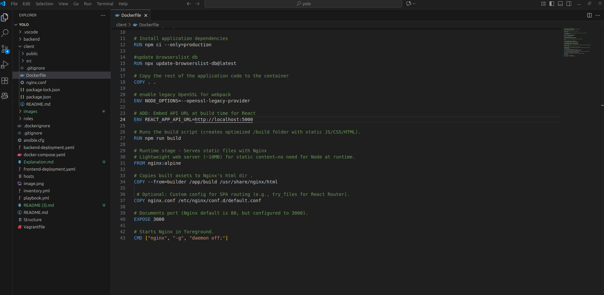
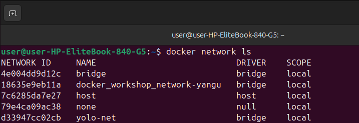
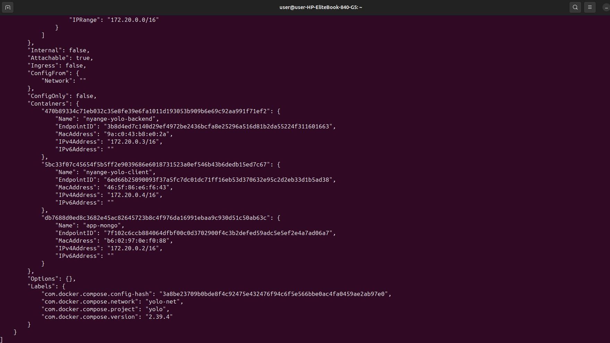
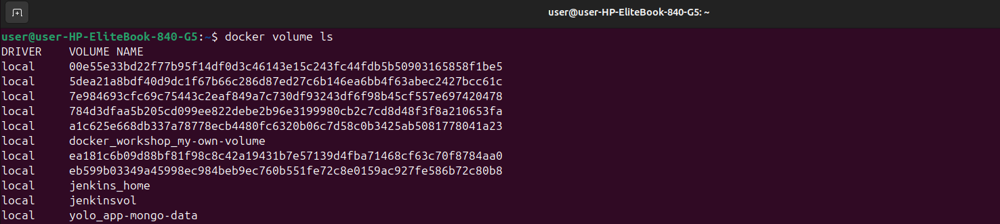
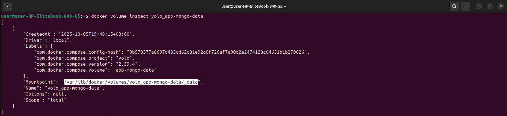

# Explanation for Docker Containerization Assignment

This document explains my implementation for containerizing the e-commerce application from the forked repo (https://github.com/Vinge1718/yolo). I'll cover the reasoning for choices, step-by-step setup, and how everything works, including detailed line-by-line breakdowns of Dockerfiles and docker-compose.yml.

## Understanding the Frontend README (Create React App)
The frontend (in ./client) was bootstrapped with Create React App (CRA), a tool from Facebook for quick React setup. The README explains scripts:

- `npm start`: Runs dev server at http://localhost:3000 with hot-reloading.
- `npm test`: Runs tests in watch mode.
- `npm run build`: Builds production-optimized static files in /build (minified, hashed).
- `npm run eject`: Irreversibly exposes configs (Webpack, Babel) for customization.

Sections like Code Splitting, Bundle Analysis, PWA, Advanced Config, Deployment, and Troubleshooting provide links for deeper learning. We use `npm run build` in Dockerfile for static serving with Nginx.



## 1. Choice of the Base Image on Which to Build Each Container
For backend: `node:20-alpine` (lightweight, secure, ~150MB). For frontend: `node:20-alpine` build, `nginx:alpine` runtime (~10MB + assets). Mongo: `mongo:5.0`. 

 

## 2a. Backend Dockerfile (./backend/Dockerfile)
This uses a multi-stage build to separate dependency installation (build stage) from runtime, reducing size by discarding unnecessary tools.

```
# Build stage - Installs dependencies in a temporary image
- FROM node:20-alpine AS builder  # Base image: Lightweight Node.js v20 on Alpine Linux (~150MB). 'AS builder' names this stage for copying later.
- WORKDIR /app  # Sets working directory to /app inside the container for organizing files.
- COPY package*.json ./  # Copies package.json and package-lock.json first for caching—Docker caches this layer if deps don't change, speeding builds.
- RUN npm ci --only=production  # Installs only production dependencies (no devDeps like Jest), using 'ci' for exact lockfile match. Keeps size small.
- COPY . .  # Copies the rest of the app code (server.js, routes, etc.) into /app.

# Runtime stage - Slim image for running the app
- FROM node:20-alpine  # Same base for runtime—ensures compatibility, no need for extra installs.
- WORKDIR /app  # Resets working dir in the new stage.
- COPY --from=builder /app .  # Copies only the built app and prod deps from the builder stage—discards build tools.
- EXPOSE 5000  # Documents that the app listens on port 5000 (docker-compose handles mapping).
 CMD ["node", "server.js"]  # Default command to start the app (runs server.js).
```

[./backend/Dockerfile]

## 2b. Frontend Dockerfile (./client/Dockerfile)
This builds React static assets and serves them with Nginx for production efficiency.

```
# Build stage - Builds React app
- FROM node:20-alpine AS builder  # Base: Node v20 on Alpine for installing deps and building.
- WORKDIR /app  # Working dir for files.
- COPY package*.json ./  # Copy deps files for caching.
- RUN npm ci  # Installs all deps (includes build tools like webpack; not --only=production since build needs them).
- COPY . .  # Copy app code.
- ENV NODE_OPTIONS=--openssl-legacy-provider # enable legacy OpenSSL for webpack
- ENV REACT_APP_API_URL=http://localhost:5000  # ADD: Embed API URL at build time for React

- RUN npm run build  # Runs the build script (creates optimized /build folder with static JS/CSS/HTML).

# Runtime stage - Serves static files with Nginx
- FROM nginx:alpine  # Lightweight web server (~10MB) for static content—no need for Node at runtime.
- COPY --from=builder /app/build /usr/share/nginx/html  # Copies built assets to Nginx's html dir .
- COPY nginx.conf /etc/nginx/conf.d/default.conf  # Optional: Custom config for SPA routing (e.g., try_files for React Router).
- EXPOSE 3000  # Documents port (Nginx default is 80, but configured to 3000).
- CMD ["nginx", "-g", "daemon off;"]  # Starts Nginx in foreground.
```

[./client/Dockerfile]

## 3. Docker-compose Networking (Application port allocation and a bridge network implementation) where necessary.
Docker-compose.yml orchestrates the services.

Defines frontend, backend, mongo with networks/volumes.

```
services:  # Defines the containers (microservices).

  nyange-yolo-client:  # Frontend service name.
    image: majangajohn/nyange-yolo-client:v1.0.0  # Tagged image for Docker Hub push/pull.
    build: 
      context: ./client  # Build from ./client dir (where Dockerfile is).
    container_name: nyange-yolo-client  # Custom container name for easy identification.
    stdin_open: true  # Allows interactive input (debugging).
    tty: true  # Allocates a pseudo-TTY (for shell access).
    ports:
      - "3000:3000"  # Maps host port 3000 to container 3000 (access frontend at localhost:3000).
    environment:
      - NODE_OPTIONS=--openssl-legacy-provider  # Fixes webpack/OpenSSL issue in Node v20.
    depends_on: 
      - nyange-yolo-backend  # Starts after backend.
    networks:
      - yolo-net  # Attaches to custom network.

  nyange-yolo-backend:  # Backend service.
    image: majangajohn/nyange-yolo-backend:v1.0.0  # Tagged image.
    build: 
      context: ./backend  # Build from ./backend.
    container_name: nyange-yolo-backend  # Custom name.
    stdin_open: true
    tty: true
    restart: always  # Restarts on failure (e.g., DB connect errors).
    ports:
      - "5000:5000"  # Maps host 5000 to container 5000 (browser/API access).
    environment:
      - MONGODB_URI=mongodb://app-ip-mongo:27017/yolomy  # Connection string (uses mongo service hostname).
    depends_on: 
      - app-ip-mongo  # Starts after mongo.
    networks:
      - yolo-net

  app-ip-mongo:  # MongoDB service.
    image: mongo  # Official pinned version.
    container_name: app-mongo  # Custom name.
    ports:
      - "27017:27017"  # Maps for local tools (optional).
    networks:
      - yolo-net
    volumes:
      - app-mongo-data:/data/db  # Persists data in named volume.

networks:  # Custom network section.
  yolo-net:  # Name of the bridge network.
    name: yolo-net  # Explicit name.
    driver: bridge  # Type: Bridge for internal container comms (default isolation).
    attachable: true  # Allows external containers to attach if needed.
    ipam:  # IP Address Management.
      config:
        - subnet: 172.20.0.0/16  # Custom subnet for IPs.

volumes:  # Persistent storage.
  app-mongo-data:  # Named volume for mongo data.
    driver: local  # Stores on host filesystem.
```

The custom bridge network `yolo-net` allows services to communicate via hostnames (e.g., backend pings 'app-ip-mongo'). 
We assign the same network to all for isolation and resolution. 
To list networks: `docker network ls`. 
Inspect: `docker network inspect yolo-net` (shows connected containers/IPs). 



[network-inspect-screenshot]

## 4. Docker-compose Volume Definition and Usage (where necessary).
Volumes persist data beyond container lifecycles. 

Here, `app-mongo-data` mounts to mongo's /data/db, storing products even after `docker-compose down`.
when you Run up again: Product persists. Add another.

Driver 'local' uses host storage.

To list volumes: `docker volume ls`. 
Inspect: `docker volume inspect yolo_app-mongo-data` (shows mountpoint on host, e.g., Volume at /var/lib/docker/volumes/yolo_app-mongo-data/_data ). 



[volume-inspect-screenshot]

## 5. Git Workflow Used to Achieve the Task
- Forked https://github.com/Vinge1718/yolo, 
- Cloned the repo `https://github.com/Majangajohn/yolo` locally.
- Made 15+ descriptive commits (e.g., "Modified backend Dockerfile", "Fixed DB connection env var"). 
- Used regular pushes for tracking.
- created 'containerization-assignment' branch
- Merged to master at end.


