# Overview
This project involves the containerization and deployment of a full-stack yolo application using Docker.
The process starts with installing Docker, as it's essential for all subsequent steps.


# Requirements
Before starting the containerization, you need to install Docker. Docker consists of three main components: Docker Engine (the core runtime for building and running containers), Docker CLI (the command-line interface for interacting with Docker), and Docker Compose (a tool for defining and running multi-container applications, now integrated as a CLI plugin).

To install:
- [Docker](https://docs.docker.com/engine/install/) 
- Download Docker Desktop from https://www.docker.com/products/docker-desktop (includes Engine, CLI, and Compose plugin) for Windows/Mac.
- For Ubuntu/Linux: from terminal Run `sudo apt update && sudo apt install docker-ce docker-ce-cli containerd.io docker-compose-plugin`.
- Verify installation:from terminal Run `docker --version` (checks Engine/CLI) and `docker compose version` (checks Compose).

Screenshot of Docker compose installation verification:
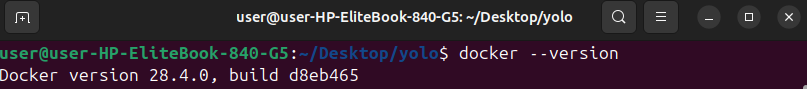
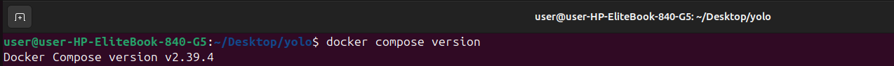 

- check for docker status to ensure its running through `sudo systemstc docker status` if not, proceed to next step to start it
- Start Docker service: On Linux, `sudo systemctl start docker`.

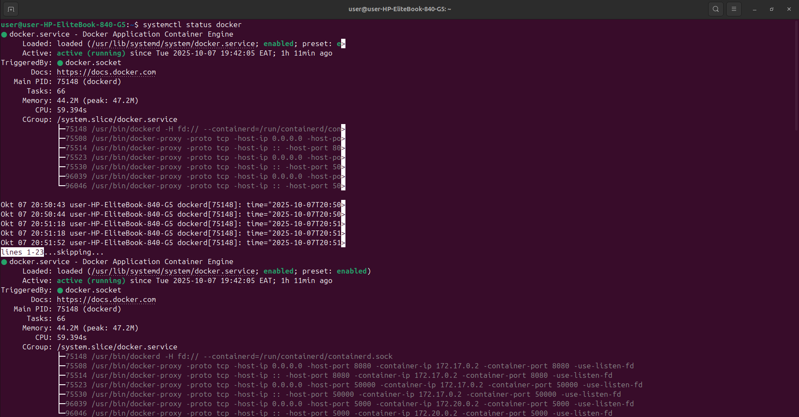 

This setup ensures you have a complete environment for building and orchestrating containers.


# How to launch the application 
## Cloning the Repository
- First you need git installed on your station if not, follow guidelines below to install and if it already exists, which can be 
verified by running `git --version`  on terminal in linux and command line in windows, proceed to cloning step
#  🧰 Installing Git

  Follow the steps below to install Git on your machine.

  💻 For Windows (PC)

 ## Download the installer

  Go to the official Git website: https://git-scm.com/download/win

  Run the installer

  Double-click the downloaded .exe file.

  Follow the installation wizard — you can keep all default settings.

  Verify installation

  `git --version`


  ✅ If Git is installed, you’ll see an output like:

  git version 2.47.0.windows.1

##  🐧 For Linux (Ubuntu / Debian)

  Update your package index

  `sudo apt update`


  Install Git

  `sudo apt install git -y`


  Verify installation

  `git --version`


  ✅ Example output:

  git version 2.43.0

- Clone: `https://github.com/Majangajohn/yolo.git`. to your preferred location locally
- Navigate: `cd yolo`.

Screenshot of clone  

- open the root directory in code editor like vscode
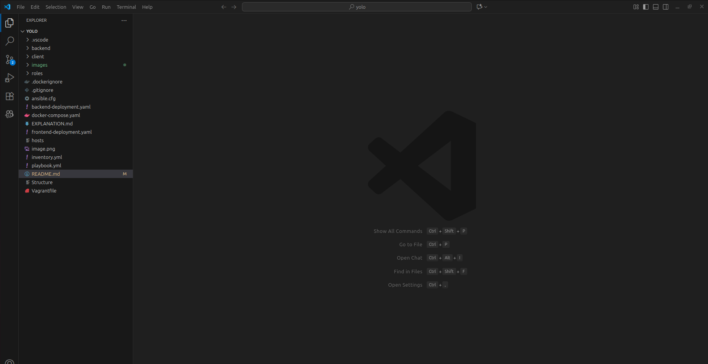 

## Building Images with Docker Compose
From vscode click on terminal and chose new terminal
In the new terminal;
Run `docker compose build`—builds images from Dockerfiles in contexts (./client, ./backend). It tags them (e.g., majangajohn/john-yolo-client:v1.0.0). 

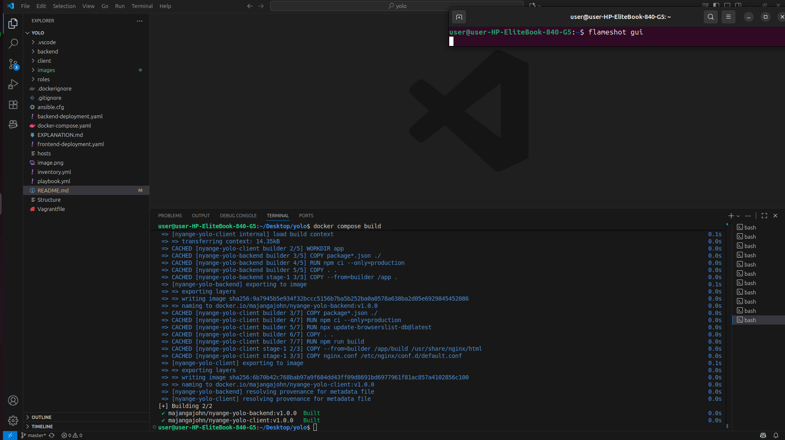 

To check images: `docker images` (lists with sizes/tags). 

 

## Running Containers with Docker Compose Up
Run `docker compose up -d`—starts containers in detached mode (-d). 
Pulls mongo if needed, creates network/volume, starts services in order (depends_on). 

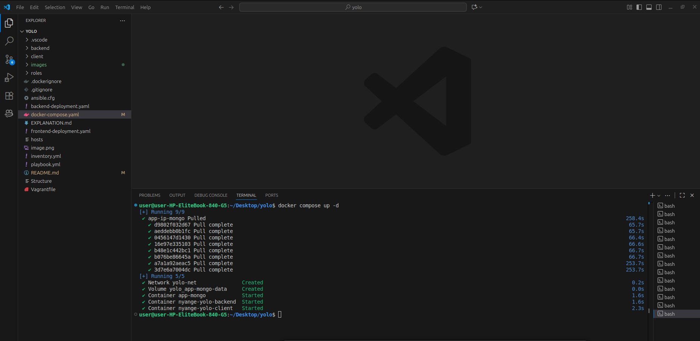 

List running: `docker ps` (shows ports, names). 

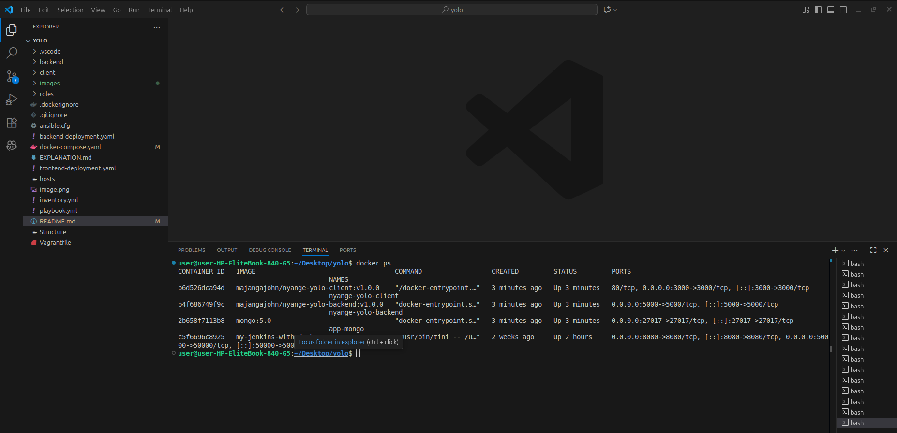 

## Volumes and Networks: Listing and Inspecting
Networks enable comms (same network for hostname resolution). 
List: `docker network ls`. 
Inspect: `docker network inspect yolo-net` (IPs, containers). 
We use same network for backend to reach mongo via 'app-ip-mongo'. 

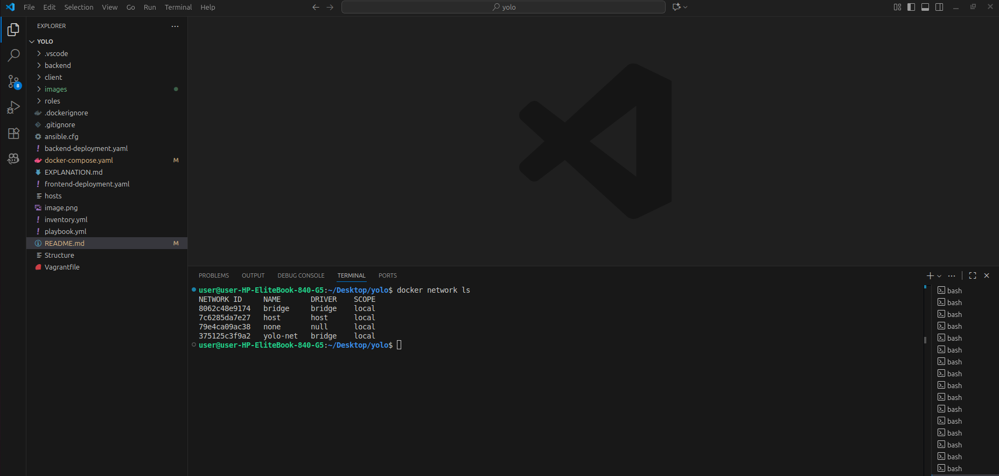 
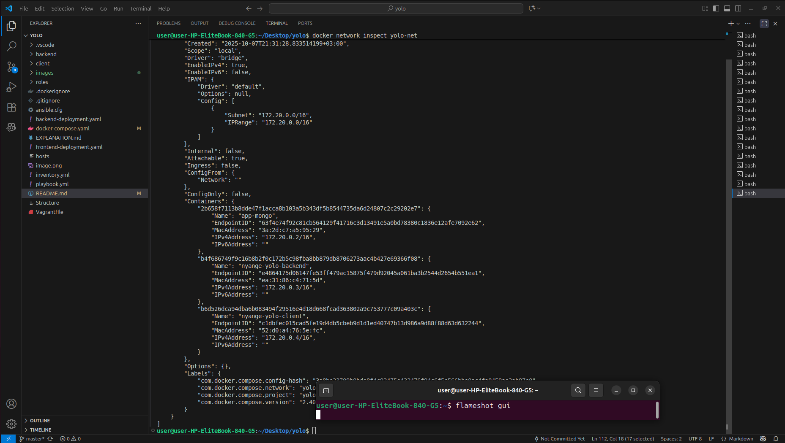

Volumes persist data. List: `docker volume ls`. 
Inspect: `docker volume inspect yolo_app-mongo-data` (mountpoint: /var/lib/docker/volumes/app-mongo-data/_data). 

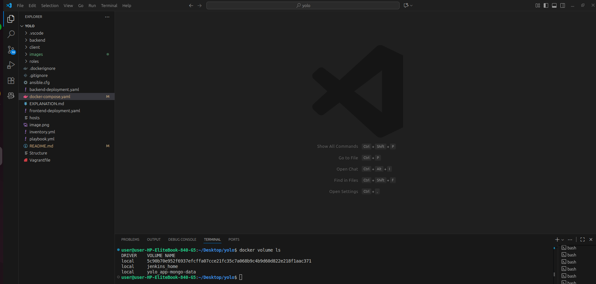 
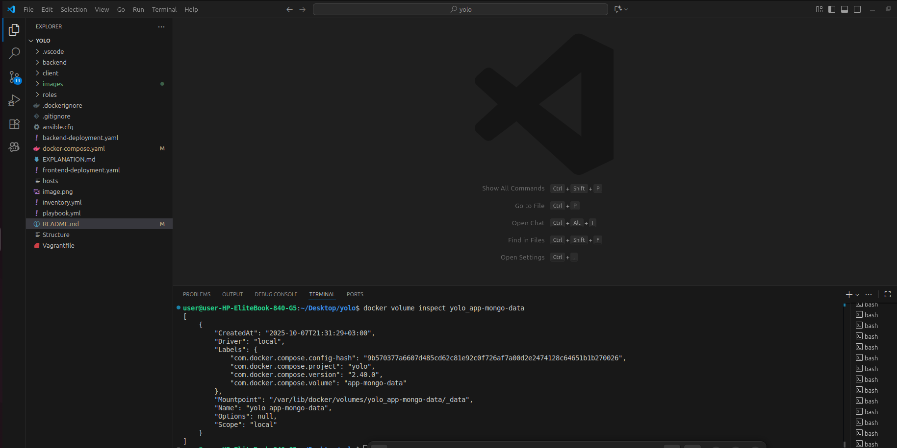

## Testing the Application and Persistence
Access frontend: Open browser to http://localhost:3000. Add product (e.g., name: "Test Shirt", price: 19.99, quantity: 10, description: "Test shirt").
 See listing. 

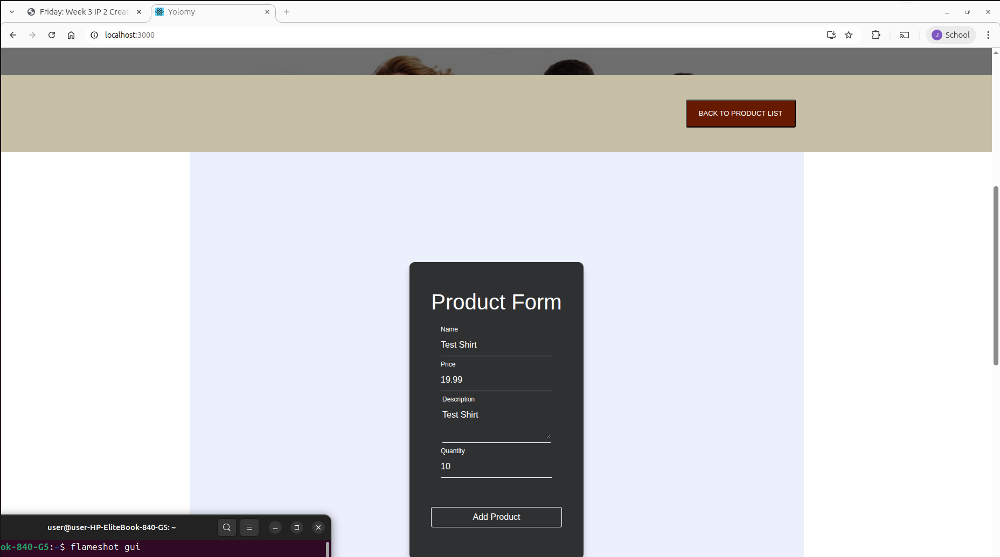 
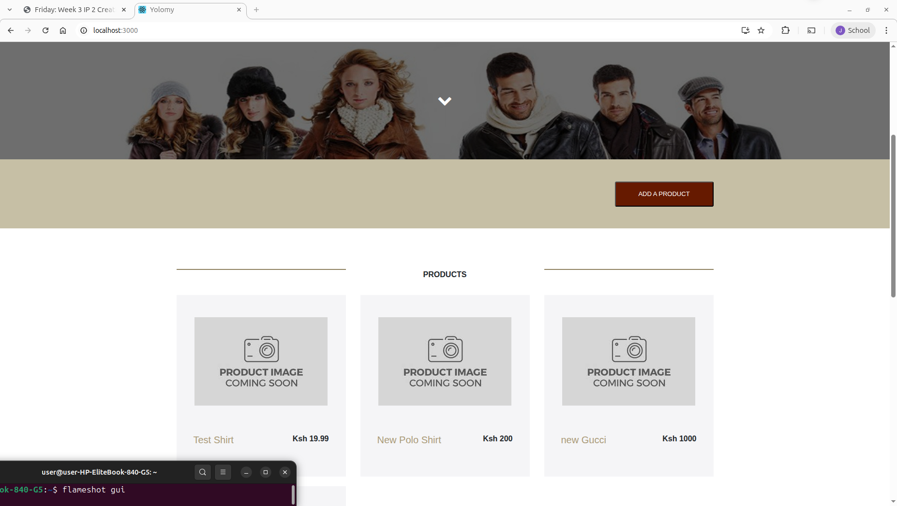

## checking for data persistence
Run `docker compose down`—stops/removes containers (but not volumes). 

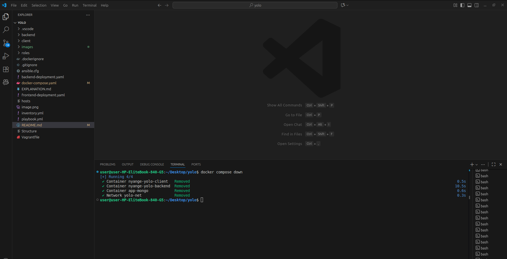

Run `docker compose up -d` again. 
Access browser, previous product persists. 
Add another; it saves. 
Persistence via volume (data in /data/db survives container removal). 

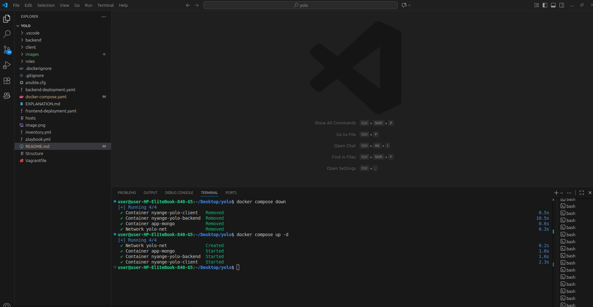

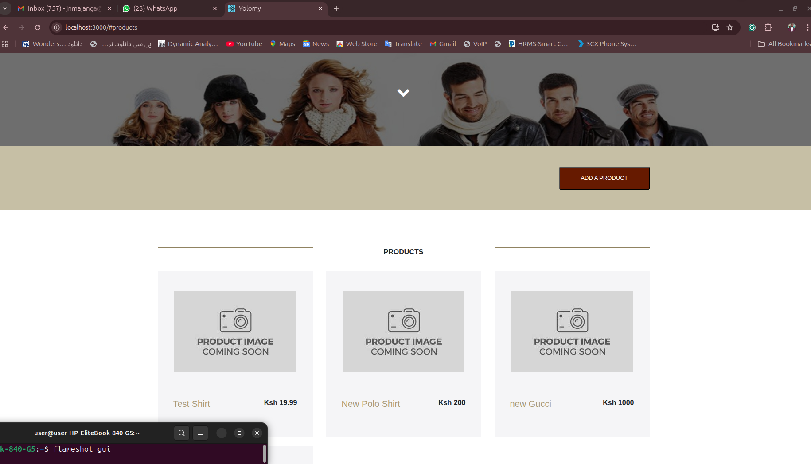

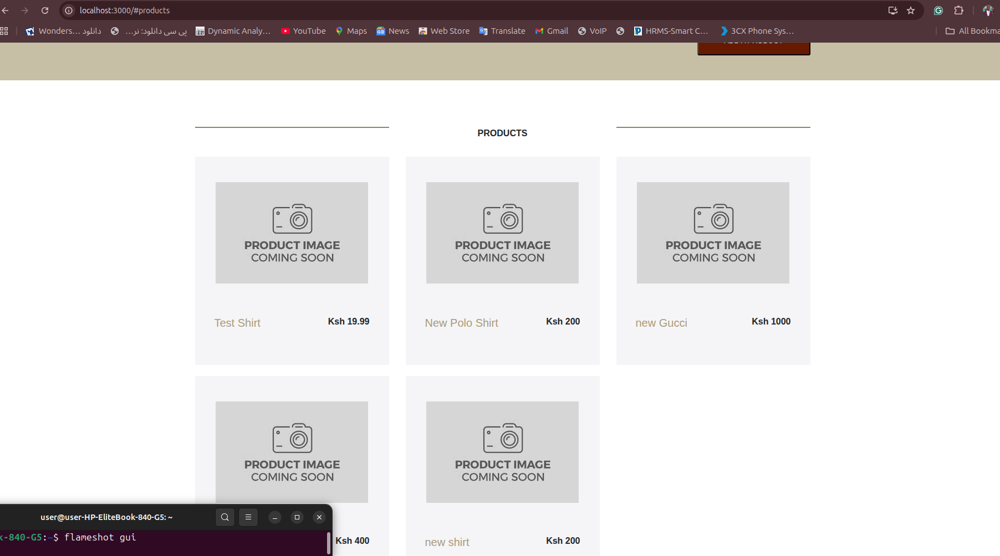

## Pushing Images to Docker Hub
- Create an account on docker hub (`https://hub.docker.com/`)
- From the vscode terminal, run:
Login: `docker login` (prompts for username/password). 
Verifies credentials. 

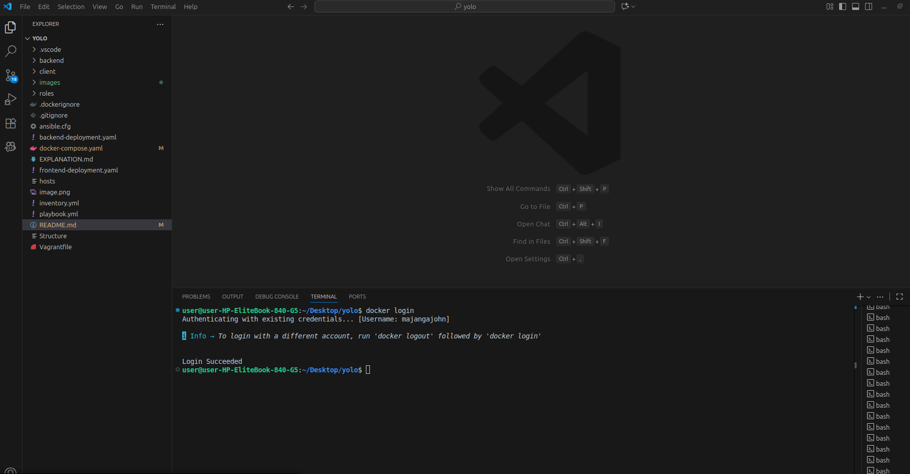

- After successful verification back in the terminal in vs code run;
Push: `docker push majangajohn/nyange-yolo-client:v1.0.0` 
and same for backend,
`docker push majangajohn/nyange-yolo-backend:v1.0.0` (replace docker_hub_YOUR_USERNAME and containers name)

- Use semver tags (majangajohn/nyange-yolo-backend:v1.0.0) for versioning. Custom container names (nyange-yolo-backend) for easy `docker ps`. 
.dockerignore excluded junk 
.Multi-stage builds for slim images.

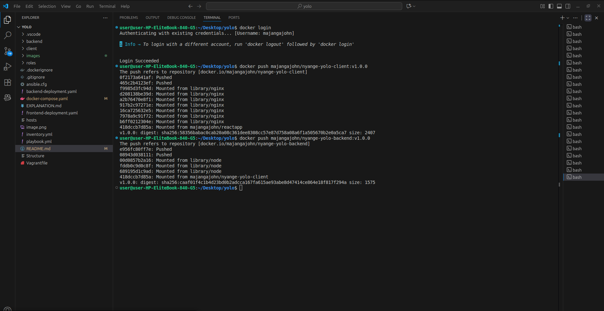

On Docker Hub: 
See versions/sizes. 
My Dockerfiles use multi-stage, --only=production, Alpine to keep slim (e.g., discard devDeps). 

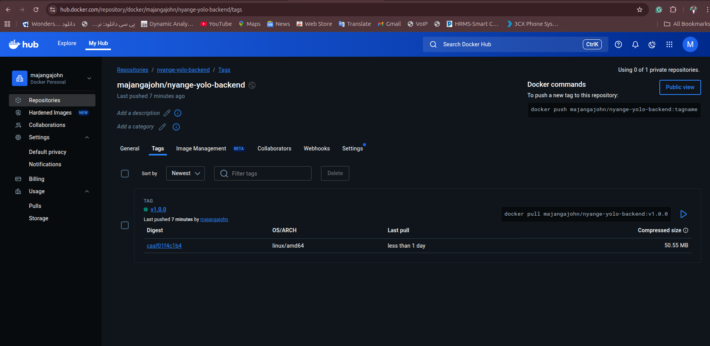
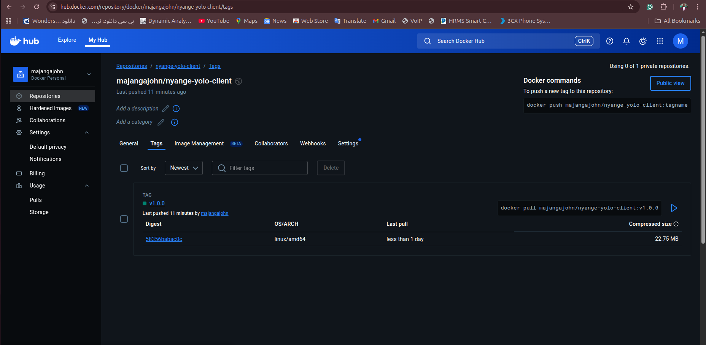

# Link to Docker Hub: 
https://hub.docker.com/repositories/majangajohn

# Modifying to Pull from Docker Hub Instead of Building Locally
- After you have pushed your image to docker hub, you can use remote images from docker hub instead of local ones
- To use remote images: Remove `build:` sections in docker-compose.yml, keep `image:`. It pulls from Hub.

Example modified yaml:
```
services:
  nyange-yolo-client:
    image: majangajohn/nyange-yolo-client:v1.0.0  # Pulls from Hub
    # No build:
    # ... rest

    nyange-yolo-backend:
    image: majangajohn/nyange-yolo-backend:v1.0.0  # Pulls from Hub
    # No build:
    # ... rest
```

Run `docker compose up -d`, pulls it not local. 


- Custom names (e.g., nyange-yolo-backend) aid tracking (`docker ps`). Change to your preference (e.g., my-backend) in yaml—still identifiable. Update tags/images accordingly. 

 
 